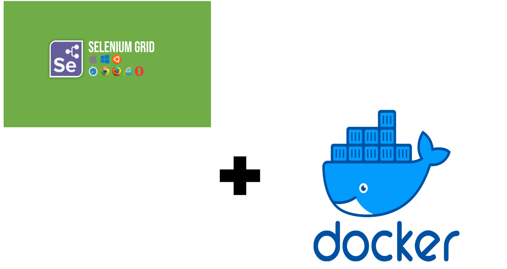

## selenium grid setup and execution with docker

#### This project demonstrates selenium grid execution on docker using : 
- docker-compose  
- docker-compose.yml

### setup and execution
- download docker desktop
- `git clone <repository url>`
- `mvn clean install` for first time execution
- `mvn clean test` for regular execution

### Notes

- `docker ps -a | to check docker installation status and running container status`
- `docker-compose -f <path of docker-compose.yml file> up -d | to pull all listed images and excute through .yml file`
- [docker-hub-link](https://hub.docker.com/_/registry/)